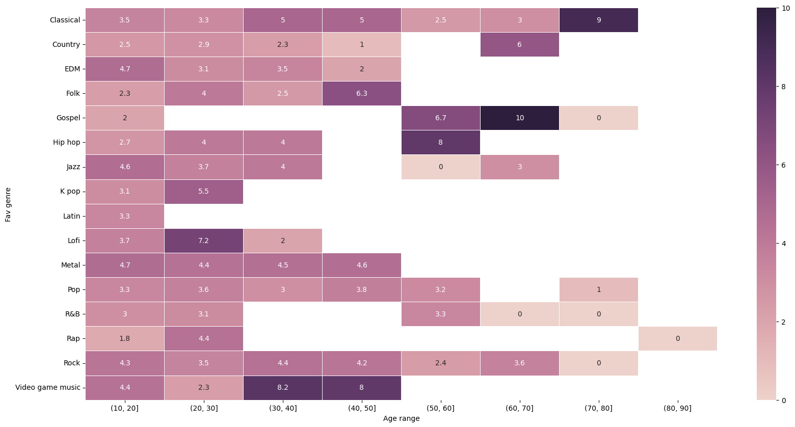
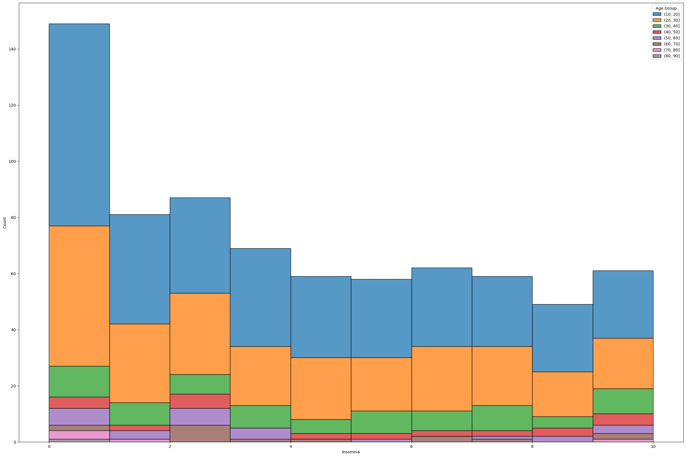
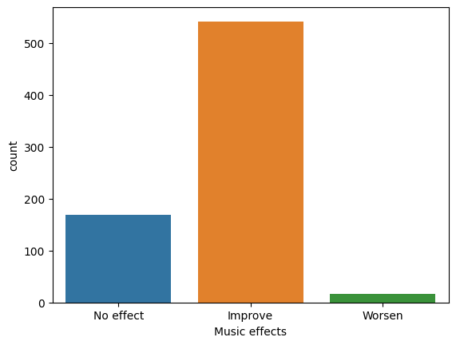

# How music influence mental health of peoples

## Technical requirements and data


```python
# Import external librairies
%pylab inline
import pandas as pd
import seaborn as sns
import numpy as np
import matplotlib.pyplot as plt # To use pie
```

    %pylab is deprecated, use %matplotlib inline and import the required libraries.
    Populating the interactive namespace from numpy and matplotlib


```python
# Our dataset is about the effect of music on some psychological human issues
# https://www.kaggle.com/datasets/catherinerasgaitis/mxmh-survey-results
data = pd.read_csv("./music_dataset.csv")
# data
```


```python
# data.info()
```

## Global Informations


```python
services = data["Primary streaming service"].value_counts()
labels = list(data["Primary streaming service"].dropna().unique())
data["has_improved"] = data["Music effects"] == "Improve"
```


```python
plt.figure(figsize=(5, 5))
plt.title("Primary streaming service",fontsize = 18)
plt.pie(services, labels=labels, autopct = '%0.0f%%')
plt.show()
```


    

    


```python
all_effects = data.corr(numeric_only = True)['Age']
all_effects.sort_values()
sns.heatmap(data.corr(numeric_only = True))
```


    <AxesSubplot: >


    

    


```python
plt.figure(figsize=(8,6))
sns.lineplot(x=data['Fav genre'], y=data['Age'], errorbar=None)
plt.xticks(rotation=90)
```


    ([0, 1, 2, 3, 4, 5, 6, 7, 8, 9, 10, 11, 12, 13, 14, 15],
     [Text(0, 0, 'Latin'),
      Text(1, 0, 'Rock'),
      Text(2, 0, 'Video game music'),
      Text(3, 0, 'Jazz'),
      Text(4, 0, 'R&B'),
      Text(5, 0, 'K pop'),
      Text(6, 0, 'Country'),
      Text(7, 0, 'EDM'),
      Text(8, 0, 'Hip hop'),
      Text(9, 0, 'Pop'),
      Text(10, 0, 'Rap'),
      Text(11, 0, 'Classical'),
      Text(12, 0, 'Metal'),
      Text(13, 0, 'Folk'),
      Text(14, 0, 'Lofi'),
      Text(15, 0, 'Gospel')])


    

    


## Favorite music genre

### Favorite music genres per age range compared to Anxiety level


```python
anxiety = data[['Age', 'Hours per day', 'Anxiety', 'Fav genre']].copy()
anxiety['Age range'] = pd.cut(anxiety['Age'].tolist(), list(range(10, 100, 10)))
anxieties = anxiety.pivot_table(index="Fav genre", columns="Age range", values="Anxiety")
f, ax = plt.subplots(figsize=(20, 10))
sns.heatmap(anxieties, annot=True, linewidths=.5, ax=ax)
```


    <AxesSubplot: xlabel='Age range', ylabel='Fav genre'>


    

    


### Favorite music genres per age range compared to Depression level


```python
depression = data[['Age', 'Hours per day', 'Depression', 'Fav genre']].copy()
depression['Age range'] = pd.cut(anxiety['Age'].tolist(), list(range(10, 100, 10)))
depressions = depression.pivot_table(index="Fav genre", columns="Age range", values="Depression")
f, ax = plt.subplots(figsize=(20, 10))
sns.heatmap(depressions, annot=True, linewidths=.5, ax=ax, cmap="crest")
```


    <AxesSubplot: xlabel='Age range', ylabel='Fav genre'>


    

    


### Favorite music genres per age range compared to Insomnia level


```python
insomnia = data[['has_improved', 'Age', 'Hours per day', 'Insomnia', 'Fav genre']].copy()
insomnia['Age range'] = pd.cut(anxiety['Age'].tolist(), list(range(10, 100, 10)))
insomnias = insomnia.pivot_table(index="Fav genre", columns="Age range", values="Insomnia")
f, ax = plt.subplots(figsize=(20, 10))
sns.heatmap(insomnias, annot=True, linewidths=.5, ax=ax, cmap=sns.cubehelix_palette(as_cmap=True))
```


    <AxesSubplot: xlabel='Age range', ylabel='Fav genre'>


    

    


### Favorite music genres per age range compared to OCD level


```python
ocd = data[['Age', 'Hours per day', 'OCD', 'Fav genre']].copy()
ocd['Age range'] = pd.cut(anxiety['Age'].tolist(), list(range(10, 100, 10)))
ocds = ocd.pivot_table(index="Fav genre", columns="Age range", values="OCD")
f, ax = plt.subplots(figsize=(20, 10))
sns.heatmap(ocds, annot=True, linewidths=.5, ax=ax, cmap='viridis')
```


    <AxesSubplot: xlabel='Age range', ylabel='Fav genre'>


    

    


## Music genre ranking


```python
labels = ['Anxiety', 'Depression','Insomnia', 'OCD']
x = np.arange(len(labels))
width = 0.05

f, ax = plt.subplots(figsize=(30, 10))

b1 = ax.bar(x-8*width, data[(data['Fav genre'] == "Classical")].median(numeric_only = True)[-5:-1], width, color = sns.color_palette("colorblind")[0], label = "Classical")
b2 = ax.bar(x-7*width, data[(data['Fav genre'] == "Country")].median(numeric_only = True)[-5:-1], width, color = sns.color_palette("colorblind")[1], label = "Country")
b3 = ax.bar(x-6*width, data[(data['Fav genre'] == "EDM")].median(numeric_only = True)[-5:-1], width, color = sns.color_palette("colorblind")[2], label = "EDM")
b4 = ax.bar(x-5*width, data[(data['Fav genre'] == "Folk")].median(numeric_only = True)[-5:-1], width, color = sns.color_palette("colorblind")[3], label = "Folk")
b5 = ax.bar(x-4*width, data[(data['Fav genre'] == "Gospel")].median(numeric_only = True)[-5:-1], width, color = sns.color_palette("colorblind")[4], label = "Gospel")
b6 = ax.bar(x-3*width, data[(data['Fav genre'] == "Hip hop")].median(numeric_only = True)[-5:-1], width, color = sns.color_palette("colorblind")[5], label = "Hip hop")
b7 = ax.bar(x-2*width, data[(data['Fav genre'] == "Jazz")].median(numeric_only = True)[-5:-1], width, color = sns.color_palette("colorblind")[6], label = "Jazz")
b8 = ax.bar(x-1*width, data[(data['Fav genre'] == "K pop")].median(numeric_only = True)[-5:-1], width, color = sns.color_palette("colorblind")[7], label = "K pop")
b9 = ax.bar(x+1*width, data[(data['Fav genre'] == "Latin")].median(numeric_only = True)[-5:-1], width, color = sns.color_palette("colorblind")[8], label = "Latin")
b10 = ax.bar(x+2*width, data[(data['Fav genre'] == "Lofi")].median(numeric_only = True)[-5:-1], width, color = sns.color_palette("colorblind")[9], label = "Lofi")
b11 = ax.bar(x+3*width, data[(data['Fav genre'] == "Metal")].median(numeric_only = True)[-5:-1], width, color = sns.color_palette("bright")[8], label = "Metal")
b12 = ax.bar(x+4*width, data[(data['Fav genre'] == "Pop")].median(numeric_only = True)[-5:-1], width, color = sns.color_palette("bright")[6], label = "Pop")
b13 = ax.bar(x+5*width, data[(data['Fav genre'] == "R&B")].median(numeric_only = True)[-5:-1], width, color = sns.color_palette("bright")[4], label = "R&B")
b14 = ax.bar(x+6*width, data[(data['Fav genre'] == "Rap")].median(numeric_only = True)[-5:-1], width, color = sns.color_palette("bright")[2], label = "Rap")
b15 = ax.bar(x+7*width, data[(data['Fav genre'] == "Rock")].median(numeric_only = True)[-5:-1], width, color = sns.color_palette("bright")[0], label = "Rock")
b16 = ax.bar(x+8*width, data[(data['Fav genre'] == "Video game music")].median(numeric_only = True)[-5:-1], width, color = sns.color_palette("bright")[9], label = "Video game music")


# Set Rank from 0 to 10
ax.set_ylim([0, 10])
ax.set_ylabel('Rank')

ax.set_title('Mental health x Favorite music genre ranking distribution')
ax.set_xticks(x, labels)

ax.legend()
```


    <matplotlib.legend.Legend at 0x17f6e4150>


    

    


## Mental illnesses according to age


```python
# Group by range of ages
age = data[["Anxiety","Depression","Insomnia","OCD","Age"]].copy() 
age["Age Group"] = pd.cut(age["Age"].tolist(),list(range(10, 100, 10)))
```

### Anxiety


```python
# Create a chart to see Anxiety by group of age
plt.figure(figsize=(30, 20))
sns.histplot(age, x="Anxiety", bins=10, hue="Age Group", multiple="stack")
plt.show()
```


    

    


### Insomnia


```python
plt.figure(figsize=(30, 20))
sns.histplot(age, x="Insomnia",bins=10,hue="Age Group", multiple="stack")
```


    <AxesSubplot: xlabel='Insomnia', ylabel='Count'>


    

    


## Effect of music on mental illnesses


```python
sns.countplot(data, x='Music effects')
```


    <AxesSubplot: xlabel='Music effects', ylabel='count'>


    

    


```python
plt.figure(figsize=(8,7))
sns.countplot(y = data['Primary streaming service'],hue = data['Music effects'])
# We can see that the platform does not specifically affect the effect of music on people's mental illnesses
```


    <AxesSubplot: xlabel='count', ylabel='Primary streaming service'>


    

    


```python
plt.figure(figsize=(8,6))
sns.barplot(x=data['Fav genre'], y=data['Age'], hue=data['Music effects'], errwidth=0, palette='coolwarm')
plt.xticks(rotation=90)
```


    (array([ 0,  1,  2,  3,  4,  5,  6,  7,  8,  9, 10, 11, 12, 13, 14, 15]),
     [Text(0, 0, 'Latin'),
      Text(1, 0, 'Rock'),
      Text(2, 0, 'Video game music'),
      Text(3, 0, 'Jazz'),
      Text(4, 0, 'R&B'),
      Text(5, 0, 'K pop'),
      Text(6, 0, 'Country'),
      Text(7, 0, 'EDM'),
      Text(8, 0, 'Hip hop'),
      Text(9, 0, 'Pop'),
      Text(10, 0, 'Rap'),
      Text(11, 0, 'Classical'),
      Text(12, 0, 'Metal'),
      Text(13, 0, 'Folk'),
      Text(14, 0, 'Lofi'),
      Text(15, 0, 'Gospel')])


    

    


```python
# Does the effect of the music have more effect when you work or not?
sns.countplot(data, x='Music effects', hue="While working")
```


    <AxesSubplot: xlabel='Music effects', ylabel='count'>


    

    

